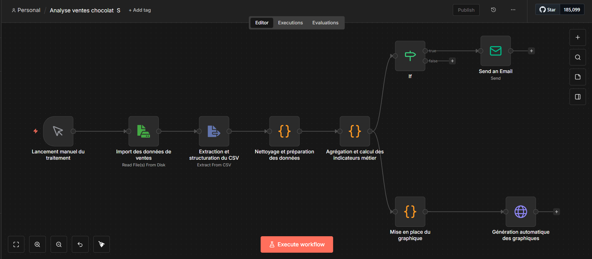
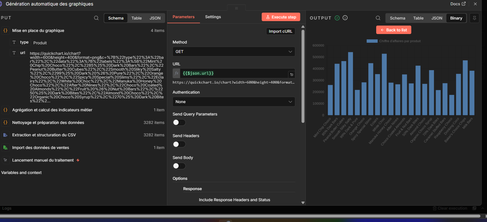
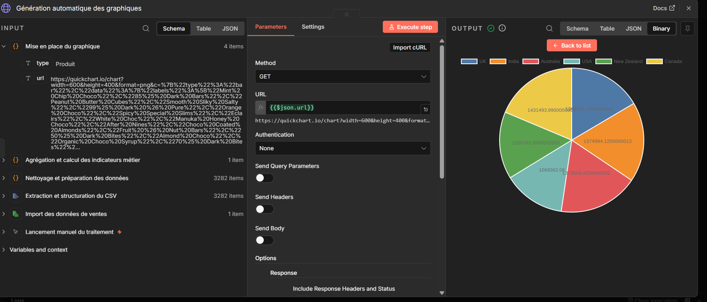
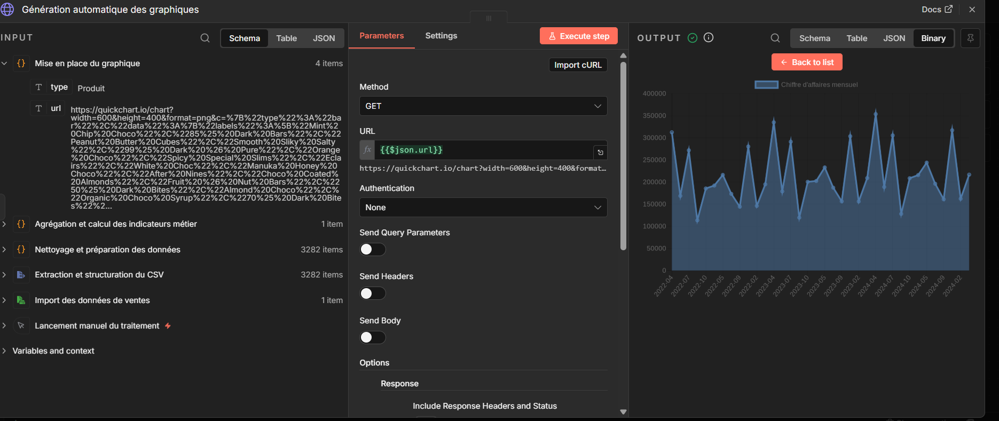
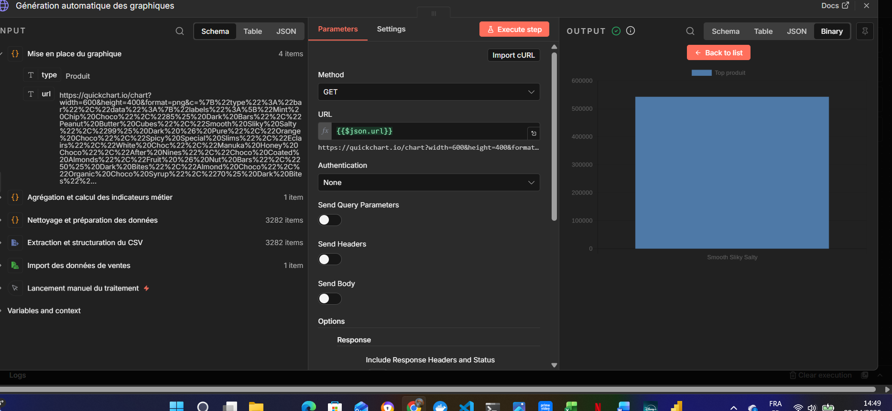

# Analyse automatisée des ventes de chocolat avec n8n

## Description

Ce projet met en place un **workflow automatisé avec n8n** permettant d’analyser des données de ventes à partir d’un fichier CSV.

Le workflow réalise automatiquement :

- Le nettoyage des données
- Le calcul d’indicateurs métier
- La détection d’anomalies
- La génération de graphiques
- L’envoi d’alertes en cas de baisse de performance

##Objectif : démontrer une **approche automatisée et intelligente de l’analyse de données**, sans outil BI externe.

---

##  Fonctionnalités

### Analyse métier

- Chiffre d’affaires par produit
- Chiffre d’affaires par pays
- Chiffre d’affaires par vendeur
- Chiffre d’affaires mensuel
- Moyenne mensuelle
- Top produit

---

###  Détection d’anomalies

- Détection de ventes négatives
- Détection de baisse > 20% d’un mois à l’autre
- Génération d’une alerte automatique

---

###  Visualisation

- Génération de graphiques via **QuickChart API**
- Graphiques produits automatiquement :
  - CA par produit
  - CA par pays
  - CA mensuel
  - Top produit

---

### Notification

- Envoi automatique d’un email en cas de baisse détectée

---

##  Architecture du workflow

### Étapes :

1. Lancement manuel du traitement  
2. Import du fichier CSV  
3. Extraction et structuration  
4. Nettoyage des données  
5. Agrégation et calcul des indicateurs  
6. Détection de baisse (IF)  
7. Envoi d’alerte email  
8. Génération des graphiques  

---

## Exemples de résultats

### 📈 Chiffre d’affaires par produit

###  Chiffre d’affaires par pays

### CA mensuel

### Top produit

---

## ⚙️ Workflow n8n

Le workflow est disponible ici :

Workflow/Analyse ventes chocolats.json
